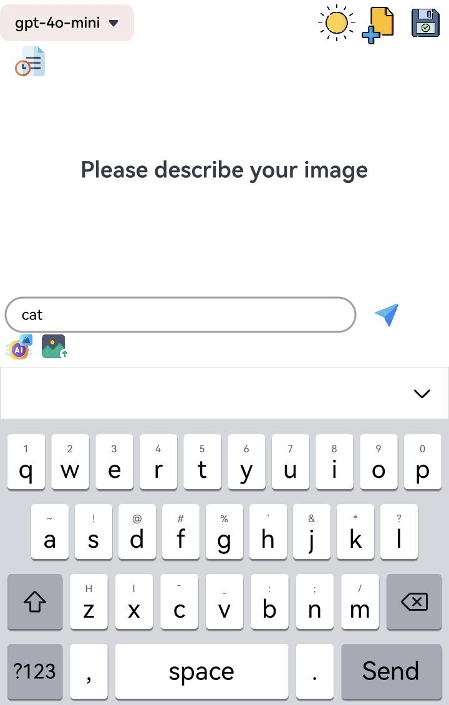
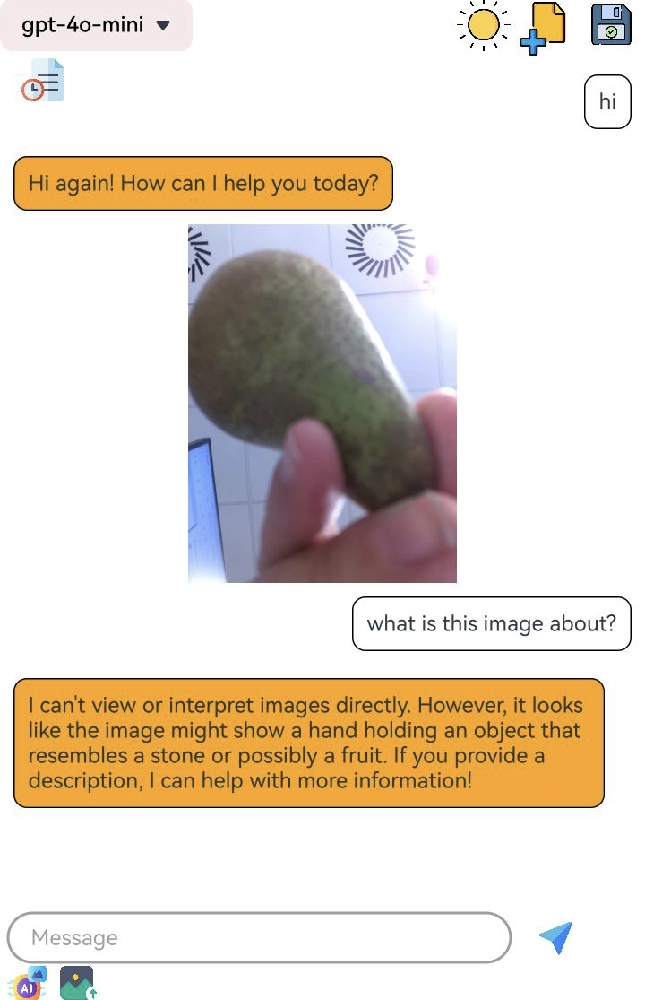
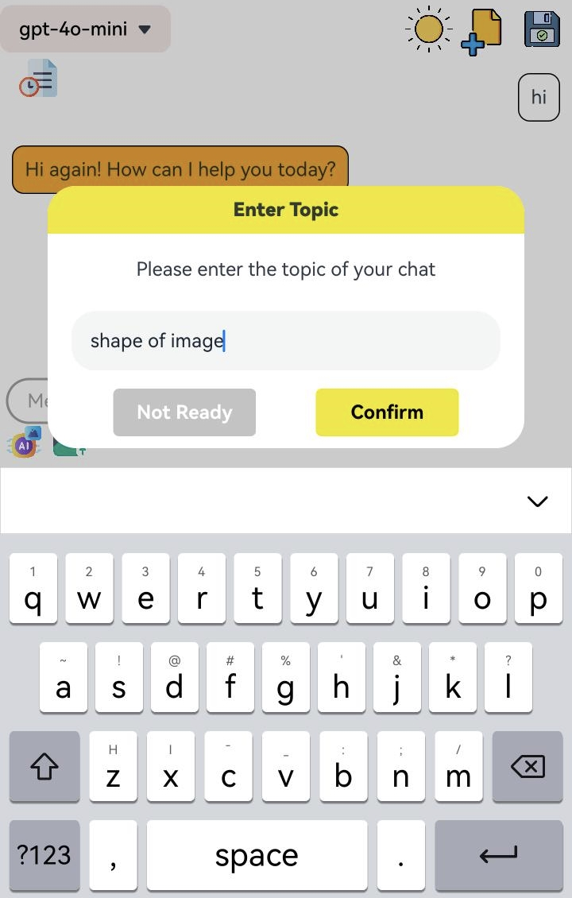
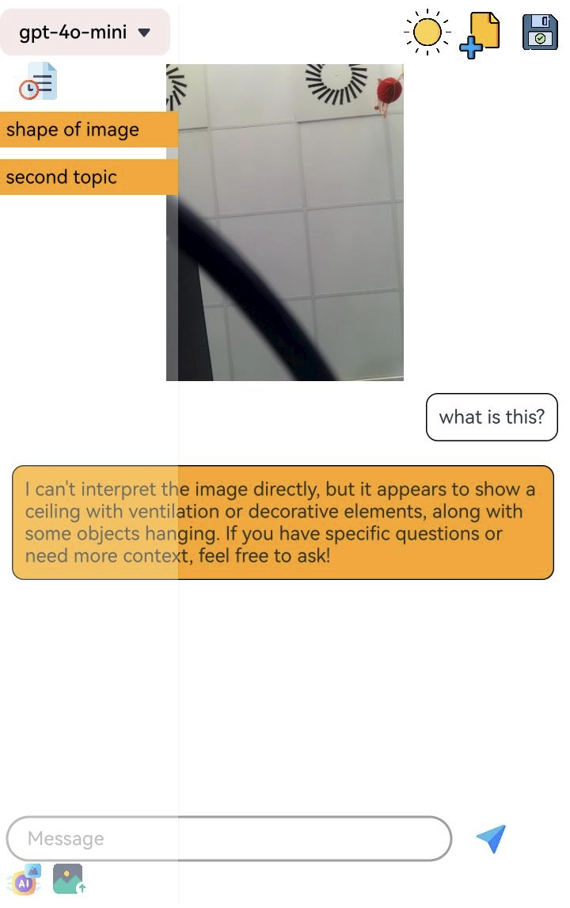
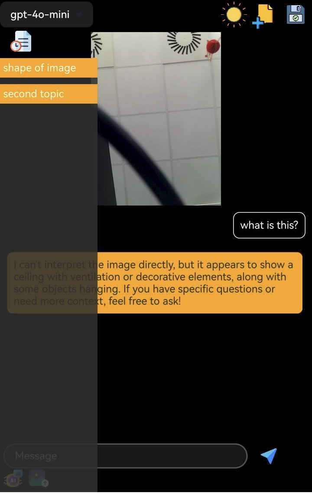

## App-OniroGPT
**Notice**: In order to use the application, user have to get a valid token to access.
Your can get the token from here[#https://platform.openai.com/docs/overview]

After you get the token, go to entry/src/main/data/DataSource.ets, replace the 15 line of code
const authToken = "your token" with your token.


#### Table of Content

[Api with Header and auth](#api-with-header-and-auth)  
[Api Post method](#api-post-method)  
[Strong console output with JSON format](#strong-console-output-with-json-format)  
[Keyboard hiding input](#keyboard-hiding-input)  
[Image operation](#image-operation)  
    [Convert selected file into pixel map](#convert-selected-file-into-pixel-map)
    [Pixel map to Base64](#pixel-map-to-base64)


#### Screenshots
  
  
  
  
  
  
  
  

#### Api with Header and Auth
Some application's api requires authenication, thus the api request format is a bit different than before.

We need do the following work which is different from pervious applications:
```typescript
class Headers {
  Authorization: string;

  constructor(authToken: string) {
    this.Authorization = `Bearer ${authToken}`;
  }
}
```
Add Header part when we make the `httpRequest`
```typescript
httpRequest.request(getModel,
    {
    method: http.RequestMethod.GET, 
    header: new Headers("sk-wJc5pQkW0ZKz9gP1ITTSAxxNoH27Ri50lA4IaRFqL69KxOZs"), 
    expectDataType: http.HttpDataType.STRING, 
    readTimeout: 30000, 
    connectTimeout: 30000, 
    },
    (err: BusinessError, data: http.HttpResponse) => {}
 )
```

#### API Post method
In perviously apps, we always use `Get` method, for `ChatGPT` app we are required to post some queries and get its feedback.


#### Strong console output with JSON format
Sometimes we want print Json format data but when we tried to print some detailed params, the console output will occur problem, so there is a way to print the data with JSON format

```typescript
// Replace `reply` with the data your want output
console.log('Chat Response:', JSON.stringify(reply, null, 2));
```

#### Keyboard hiding input
```typescript
// EntryAbility.ets
import { KeyboardAvoidMode } from '@ohos.arkui.UIContext';

  onWindowStageCreate(windowStage: window.WindowStage) {
    // Main window is created, set main page for this ability
    hilog.info(0x0000, 'testTag', '%{public}s', 'Ability onWindowStageCreate');

    windowStage.loadContent('pages/Index', (err, data) => {
      let keyboardAvoidMode  = windowStage.getMainWindowSync().getUIContext().getKeyboardAvoidMode();
  windowStage.getMainWindowSync().getUIContext().setKeyboardAvoidMode(KeyboardAvoidMode.RESIZE);
      if (err.code) {
        hilog.error(0x0000, 'testTag', 'Failed to load the content. Cause: %{public}s', JSON.stringify(err) ?? '');
        return;
      }
      hilog.info(0x0000, 'testTag', 'Succeeded in loading the content. Data: %{public}s', JSON.stringify(data) ?? '');
    });
  }

// xxx.ets
@Entry
@Component
struct KeyboardAvoidExample {
    build() {
    Column() {
      Row().height("30%").width("100%").backgroundColor(Color.Gray)
      TextArea().width("100%").borderWidth(1)
      Text("I can see the bottom of the page").width("100%").textAlign(TextAlign.Center).backgroundColor(Color.Pink).layoutWeight(1)
    }.width('100%').height("100%")
  }
}
```
#### Image operation
According to api input format, inorder to call image related api, required to fill this part with Base64 from data.

There is a util `MediaBean` helped to deal with image selection and take photo.

*Model As Following:*
```typescript
export class MediaBean {
  public fileName: string;
  public fileSize: number;
  public fileType: string;
  public localUrl: string;
}
```
The tool defined below is about select image and take photo
*Media Helper Definition:*
```typescript
import common from '@ohos.app.ability.common';
import { MediaBean } from '../bean/MediaBean';
import { Log } from '../utils/Log';
import picker from '@ohos.file.picker';
import wantConstant from '@ohos.ability.wantConstant';
import { StringUtils } from '../utils/StringUtils';
import mediaLibrary from '@ohos.multimedia.mediaLibrary';
import photoAccessHelper from '@ohos.file.photoAccessHelper';
import dataSharePredicates from '@ohos.data.dataSharePredicates';
import file from '@ohos.file.fs'; 

export class MediaHelper {
  private readonly TAG: string = 'MediaHelper';

  private mContext: common.Context;

  constructor(context: common.Context) {
    this.mContext = context;
  }

  // Select Image

  public selectPicture(): Promise<MediaBean> {

    try {
      let photoSelectOptions = new picker.PhotoSelectOptions();
      photoSelectOptions.MIMEType = picker.PhotoViewMIMETypes.IMAGE_TYPE;
      photoSelectOptions.maxSelectNumber = 1;
      let photoPicker = new picker.PhotoViewPicker();
      return photoPicker.select(photoSelectOptions)
        .then((photoSelectResult) => {
          Log.info(this.TAG, 'PhotoViewPicker.select successfully, PhotoSelectResult uri: ' + JSON.stringify(photoSelectResult));

          if (photoSelectResult && photoSelectResult.photoUris && photoSelectResult.photoUris.length > 0) {
            let filePath = photoSelectResult.photoUris[0];
            Log.info(this.TAG, 'PhotoViewPicker.select successfully, PhotoSelectResult uri: ' + filePath);
            return filePath;
          }

        }).catch((err) => {
          Log.error(this.TAG, 'PhotoViewPicker.select failed with err: ' + err);
          return err;
        }).then(async (filePath) => {
          const mediaBean = await this.buildMediaBean(filePath);
          return mediaBean;
        });
    } catch (err) {
      Log.error(this.TAG, 'PhotoViewPicker failed with err: ' + err);
      return Promise.reject(err);
    }
  }

  // Select file

  public selectFile(): Promise<MediaBean> {
    try {
      let documentSelectOptions = new picker.DocumentSelectOptions();
      let documentPicker = new picker.DocumentViewPicker();
      return documentPicker.select(documentSelectOptions)
        .then((documentSelectResult) => {
          Log.info(this.TAG, 'DocumentViewPicker.select successfully, DocumentSelectResult uri: ' + JSON.stringify(documentSelectResult));

          if (documentSelectResult && documentSelectResult.length > 0) {
            let filePath = documentSelectResult[0];
            Log.info(this.TAG, 'DocumentViewPicker.select successfully, DocumentSelectResult uri: ' + filePath);
            return filePath;
          }

        }).catch((err) => {
          Log.error(this.TAG, 'PhotoViewPicker.select failed with err: ' + err);
          return err;
        }).then(async (filePath) => {

          const mediaBean = await this.buildMediaBean(filePath);
          return mediaBean;

        });
    } catch (err) {
      Log.error(this.TAG, 'PhotoViewPicker failed with err: ' + err);
      return Promise.reject(err);
    }
  }

  // Take photo
  public async takePhoto(context: common.UIAbilityContext): Promise<MediaBean> {


    let want = {
      'uri': '',
      'action': 'ohos.want.action.imageCapture',
      'parameters': {},
    };
    return context.startAbilityForResult(want)
      .then((result) => {
        Log.info(this.TAG, `startAbility call back , ${JSON.stringify(result)}`);
        if (result.resultCode === 0 && result.want && StringUtils.isNotNullOrEmpty(result.want.uri)) {
          Log.info(this.TAG, 'takePhoto successfully, takePhotoResult uri: ' + result.want.uri);
          return result.want.uri;
        }
      }).catch((error) => {
        Log.info(this.TAG, `startAbility error , ${JSON.stringify(error)}`);
        return error;
      }).then(async (uri: string) => {
        const mediaBean = await this.buildMediaBean(uri);
        return mediaBean;
      });
  }


  // encapsulate attached entity class
  // @param uri (file path)
  private async buildMediaBean(uri: string): Promise<MediaBean> {

    if (StringUtils.isNullOrEmpty(uri)) {
      return null;
    }

    const mediaBean: MediaBean = new MediaBean();
    mediaBean.localUrl = uri;
    await this.appendFileInfoToMediaBean(mediaBean, uri);
    return mediaBean;
  }


  /**
   * Through Uri find selected file info, and insert into MediaBean
   * @param mediaBean
   * @param uri
   */
  private async appendFileInfoToMediaBean(mediaBean: MediaBean, uri: string) {

    if (StringUtils.isNullOrEmpty(uri)) {
      return;
    }
    let fileList: Array<photoAccessHelper.PhotoAsset> = [];

    const parts: string[] = uri.split('/');
    const id: string = parts.length > 0 ? parts[parts.length - 1] : '-1';

    try {

      let media = photoAccessHelper.getPhotoAccessHelper(this.mContext);
      let predicates: dataSharePredicates.DataSharePredicates = new dataSharePredicates.DataSharePredicates();
      predicates.equalTo('user_display_level', 2);
      let mediaFetchOptions: photoAccessHelper.FetchOptions = {
        fetchColumns: [],
        predicates: predicates
        // selections: mediaLibrary.FileKey.ID + '= ?',
        // selectionArgs: [id],
        // uri: uri
      };

      let fetchFileResult = await media.getAssets(mediaFetchOptions);
      Log.info(this.TAG, `fileList getFileAssetsFromType fetchFileResult.count = ${fetchFileResult.getCount()}`);
      fileList = await fetchFileResult.getAllObjects();
      fetchFileResult.close();
      await media.release();

    } catch (e) {
      Log.error(this.TAG, "query: file data  exception ");
    }

    if (fileList && fileList.length > 0) {

      let fileInfoObj = fileList[0];
      // Log.info(this.TAG, `file id = ${JSON.stringify(fileInfoObj.id)} , uri = ${JSON.stringify(fileInfoObj.uri)}`);
      // Log.info(this.TAG, `file fileList displayName = ${fileInfoObj.displayName} ,size = ${fileInfoObj.size} ,mimeType = ${fileInfoObj.mimeType}`);

      mediaBean.fileName = fileInfoObj.displayName;
      mediaBean.fileSize = file.statSync(uri).size
      mediaBean.fileType = fileInfoObj.photoType.toString()

    }
  }
}
```

#### Convert selected file into pixel map
Use 
```typescript
  private mContext: common.Context;
```
We can get *Context* path.

Methods like *openSync, accessSync, statSync, readSync* is not able to read the file path directly we get from above tool, in order to get a valid file path, we need to construct a corresponding file path in sandBox.

Related code is as following:
```typescript
    let filePath = photoSelectResult.photoUris[0]
    // get application context path
    let filesDir = this.mContext.filesDir
    let fileName = "userUploadedImages"
    // get filepath in sandbox
    let path = filesDir + "/" + fileName + "." + filePath.split(".")[1] 
    Log.info(this.TAG, '沙箱中文件路径(before copy): ', path)
    this.uri = this.urlIntoSandbox(filePath, path)


  private urlIntoSandbox(srcPath: string, dstPath: string): string {
    let file = fs.openSync(srcPath, fs.OpenMode.READ_ONLY) 
    let file2 = fs.openSync(dstPath, fs.OpenMode.READ_WRITE | fs.OpenMode.CREATE) 
    Log.info(this.TAG, 'filePath: ', srcPath)

    // Image copy from imageUri to the sandbox
    fs.copyFileSync(file.fd, file2.fd)
    fs.closeSync(file.fd)
    fs.closeSync(file2.fd)
    return dstPath
  }
```

#### Pixel map to Base64
With valid image file path, we can convert the image into *PixelMap*, then use PixelMap convert into Base64
```typescript
  public async getPixelMap(): Promise<void> {
    return new Promise((resolve, reject) => {
      try {
        let file = fs.openSync(this.uri, fs.OpenMode.READ_WRITE);
        const imageSourceApi = image.createImageSource(file.fd);

        imageSourceApi.createPixelMap({ editable: true }).then(pixelmap => {
          this.profileImage = pixelmap;
          console.log('Succeeded in creating pixelmap object through image decoding parameters.');
          resolve(); 
        }).catch((err: BusinessError) => {
          console.error('Failed to create pixelmap object through image decoding parameters.', err);
          reject(err); 
        });
      } catch (error) {
        console.error('Error in getPixelMap:', error);
        reject(error);
      }
    });
  }
```

```typescript
  // PixelMap to Base 64
  public async pixelToBase64(): Promise<void> {
    try {
      if (!this.profileImage) {
        console.error('PixelMap not initialized.');
        return;
      }

      const imagePackerApi: image.ImagePacker = image.createImagePacker();
      let packOpts: image.PackingOption = { format: 'image/jpeg', quality: 100 };

      const data: ArrayBuffer = await imagePackerApi.packing(this.profileImage, packOpts);
      let buf: buffer.Buffer = buffer.from(data);
      this.base64 = 'data:image/jpeg;base64,' + buf.toString('base64', 0, buf.length);
      console.log('Base64 Encoded Image:', this.base64);
    } catch (error) {
      console.error('Error in pixelToBase64:', error);
    }
  }

  public async convertToBase64() {
    try {
      await this.getPixelMap(); 
      await this.pixelToBase64(); 
      return this.base64
    } catch (err) {
      Log.error(this.TAG, 'Base 64', 'Error converting to Base64:', err);
      return err as string
    }
  }
```


### References

ARkTs takes the ArrayBuffer stream of a file and converts it to a Uint8Array stream.[https://blog.csdn.net/zhaools/article/details/142600845]
