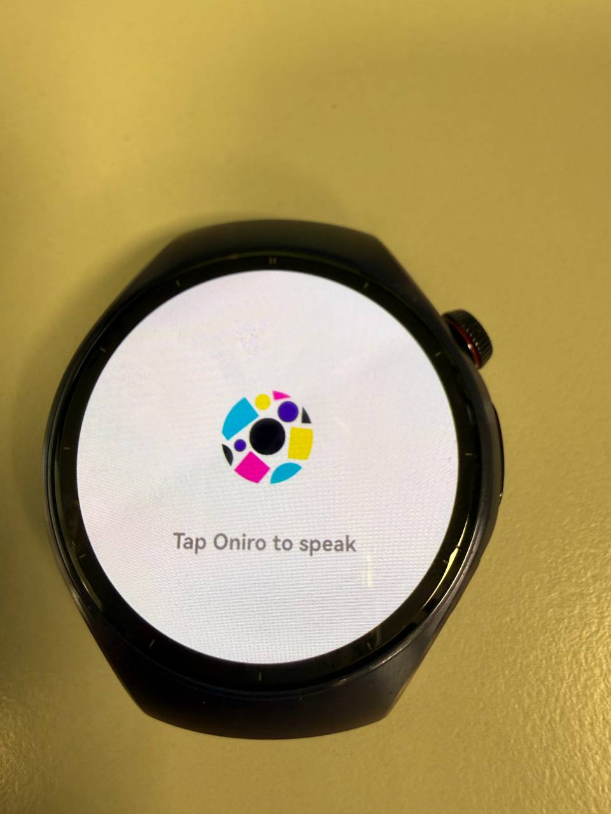
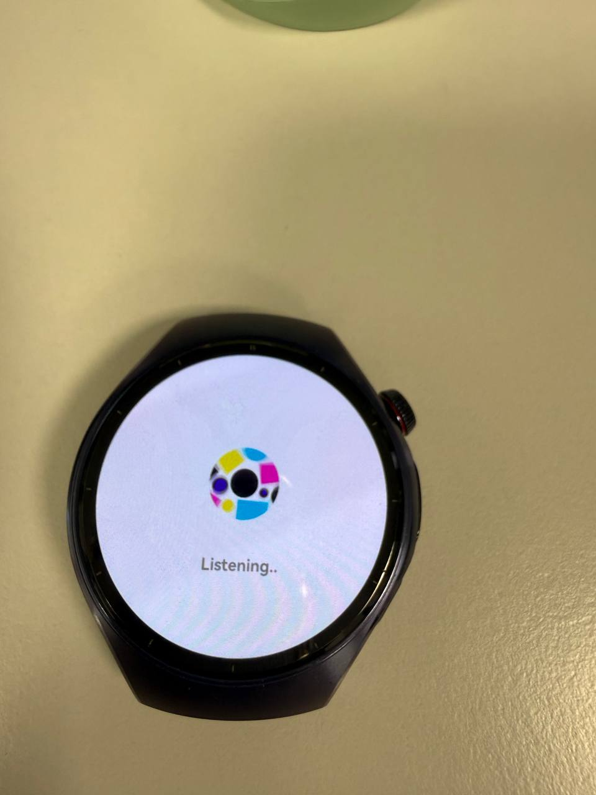
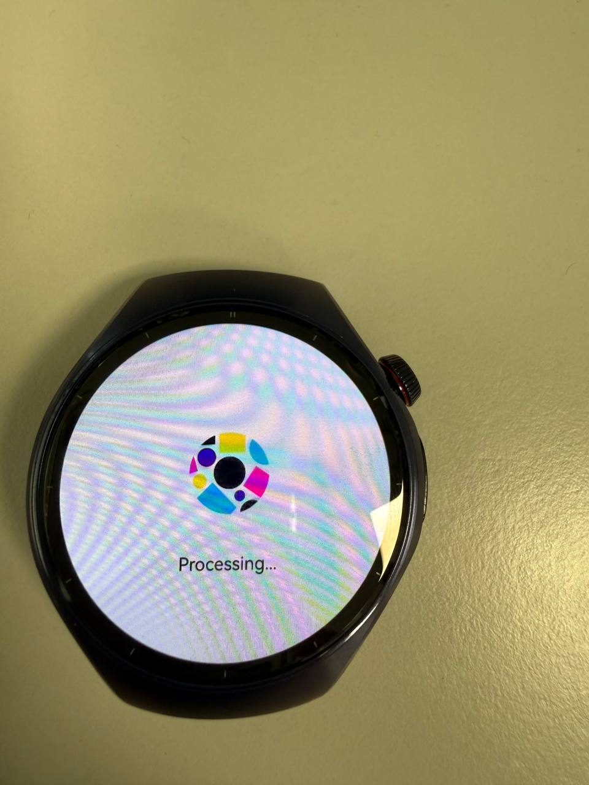
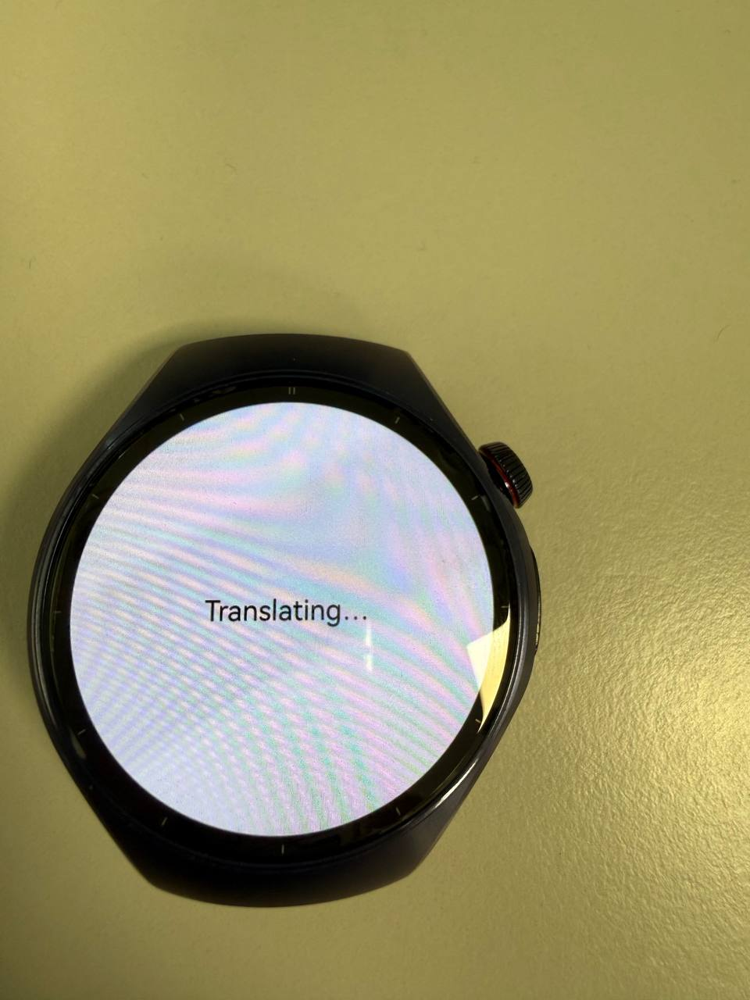
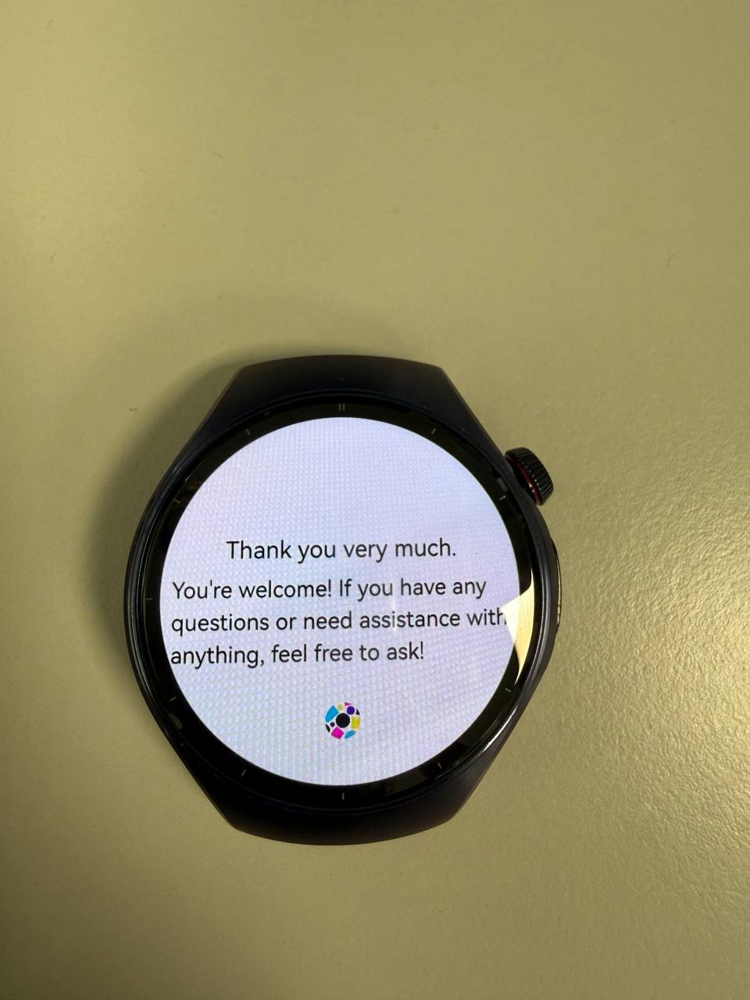

## App-OniroGPT

## Table of Contents

1. [Overview](#overview)
2. [Requirements](#requirements)
3. [Features](#features)
4. [Setup Instructions](#setup-instructions)
5. [Quick Start Guide](#quick-start-guide)

## Overview

This demo presents a lightweight wearable application for real-time **voice interaction with AI** on HarmonyOS.  
Users can start speaking by tapping the Oniro icon, and the app will capture their speech, transcribe it into text, translate it into English, and forward it to a GPT model for response.  

The application workflow is divided into three phases:  
- **Idle / Listening**: Display a rotating Oniro icon while recording user speech.  
- **Translating**: Show the recognized and translated text as user input.  
- **Responding**: Display the AI assistant’s reply in a scrollable view, with a restart button for the next query.  

This demo highlights OpenHarmony’s capabilities in **audio capture**, **state-driven ArkTS UI**, and **AI ability integration**, making it suitable for wearable devices with limited screen space.

UI effects are as follows:
  
  
  
  
  
  

> **Note:**
>
> This example uses system interfaces, so you need to manually replace the Full SDK to compile successfully. For specific steps, refer to the [Replacement Guide](https://docs.oniroproject.org/application-development/environment-setup-config/full-public-sdk/).

## Requirements

* Huawei wearable device(e.g. HUAWEI WATCH 5)
* Valid network connection
* Proper permissions (`ohos.permission.INTERNET` and `ohos.permission.MICROPHONE`)

**Notice**: In order to use the application, user have to get a valid token to access.
Your can get the token from [here](https://platform.openai.com/docs/overview)  
After you get the token, go to ```entry/src/main/data/DataSource.ets```, replace code
```const authToken = "your token"``` with your token.
 
## Features

* Record speech using the device microphone with **AudioCapturer**  
* Automatically transcribe speech into text  
* Translate recognized text into English before sending  
* Forward user queries to a GPT model for intelligent responses  
* Display AI replies in a scrollable view optimized for wearables  
* Support one-tap interaction with a rotating Oniro icon for each conversation turn


## Setup Instructions

**1. Clone the repository**

```bash
git clone https://github.com/eclipse-oniro4openharmony/app-OniroGPT
```

**2. Build and Deploy**

* Ensure you are using API level 18
* Confirm your app is a `system-level` application
* Ip connect your wearable device with DevEco Studio
> **Note:**
> If you have problem about watch connect, please refer to this [tutorial](#https://docs.oniroproject.org/application-development/create-first-eclipse-oniro-app/wearable/run-real-device/)

* Sign the application with valid signature configurations (Make sure you click `support HarmonyOS`)
* Click the `Run` button in DevEco Studio to install the application

> **Note:**
>
> See this [tutorial](https://docs.oniroproject.org/application-development/codeLabs/) for how to configure the project as a `system-level` application.

## Quick Start Guide

**1. Launch the app**  
Open the **OniroGPT** app on your wearable device. Ensure microphone permission is granted.  

**2. Start a new turn**  
Tap the **Oniro icon** to begin recording.  
The icon will spin while the app is listening.  

**3. Speak your query**  
Say your question or command out loud.  
Voice activity detection will automatically stop the recording when you finish.  

**4. Transcription & translation**  
The app transcribes your speech into text and translates it into English in real time.(Most of the time)  

**5. Get AI response**  
The translated text is sent to the GPT model.  
The assistant’s reply appears in a **scrollable response area** on the screen.  

**6. Continue the conversation**  
Tap the **small Oniro icon at the bottom** to start a new turn and keep chatting.  

**7. Exit or reset**  
Close the app to end the session, or restart a turn anytime by tapping the Oniro icon again.  
